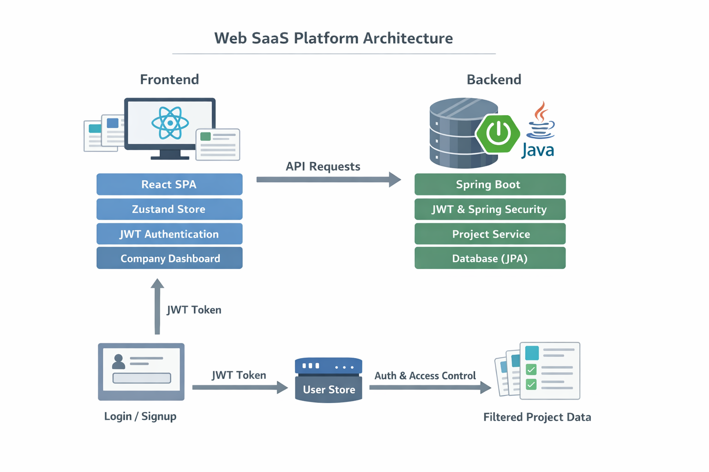
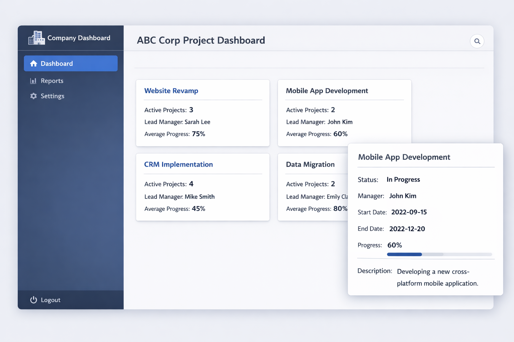

# 프로젝트 README

## UI & 아키텍처

### 아키텍처 다이어그램


### UI 샘플


## 바로가기
- [프로젝트 개요](#프로젝트-개요)  
- [기술 스택](#기술-스택)  
- [폴더 구조](#폴더-구조)  
- [주요 기능](#주요-기능)  
- [접근 제어 흐름](#접근-제어-흐름)  
- [핵심 포인트](#핵심-포인트)  

---

## 프로젝트 개요
- **Web SaaS 프로젝트**: 여러 회사가 로그인하여 자신의 프로젝트를 관리할 수 있는 시스템
- 회사별 진행 중인 프로젝트를 **이름 단위 카드로 시각화**하는 React SPA
- 공통 로그인/회원가입 페이지를 통해 회사별 접근 제어
- 프로젝트 상세보기 페이지에서 각 프로젝트의 진행 상태 확인 가능
- JWT 기반 인증 + Zustand 스토어로 로그인 사용자 상태 관리
- 백엔드 Java(Spring) 서버와 연동

---

## 기술 스택
- Frontend: React, React Router, Zustand
- Backend: Java Spring Boot, JPA, REST API
- 인증: JWT, Spring Security
- 스타일링: CSS, Flexbox

---

## 폴더 구조
### 프론트엔드 (React SPA)
```
src/
 ┣ app.md                   # 전체 앱 구조, 라우팅, AuthGuard
 ┣ company_dashboard.md     # 공통 대시보드 + 프로젝트 이름별 카드
 ┣ login.md                 # 로그인/회원가입 흐름, 회사별 접근
 ┣ service.md               # 프론트 서비스 API 호출 예시
 ┗ userUserStore.md         # Zustand 기반 사용자 상태 저장
```

### 백엔드 (Java Spring)
```
src/main/java_psh_websaas/
 ┣ security/
 ┃ ┣ jwt/
 ┃ ┃ ┣ JwtProvider.md
 ┃ ┃ ┗ jwtProviderImpl.md
 ┃ ┣ utils/SecurityUtils.md
 ┃ ┣ project_service.md
 ┃ ┣ SecurityConfig.md
 ┃ ┣ service.md
 ┃ ┗ service_duration.md
 ┣ controller.md
 ┣ domain.md
 ┣ dto.md
 ┗ repository.md
 ┣ resources/application.properties
```

---

## 주요 기능
1. **공통 로그인/회원가입**
   - 회사 선택 또는 초대 코드 입력
   - JWT 발급 시 payload에 회사 정보 포함
   - `userUserStore`로 로그인 사용자 상태 관리

   -[login.md](frontend/src/login.md)

2. **공통 대시보드**
   - 로그인한 회사 기준으로 프로젝트 데이터 필터링
   - 프로젝트 이름별 카드 시각화
   - 카드 클릭 시 이름별 상세보기 페이지 이동
   - AuthGuard를 통한 회사별 접근 제어

   - [company_dashboard.md](frontend/src/company_dashboard.md)

3. **프로젝트 상세보기 페이지**
   - 같은 이름의 진행 중 프로젝트 리스트 표시
   - 진행률, 담당자, 시작/종료일, 설명 등 표시

4. **확장 가능성**
   - 권한별 버튼/기능 추가 가능
   - 프로젝트 진행률 차트, 필터링 등 추가 가능

---

## 접근 제어 흐름
1. 로그인 → JWT 발급 → `userUserStore` 저장
2. CompanyAuthGuard 확인 → URL :company와 JWT 회사 정보 비교
3. CompanyDashboard 렌더링 → 서버에서 회사별 프로젝트 데이터 호출
4. 프로젝트 이름별 카드 렌더링 → 카드 클릭 시 상세보기 이동

* 상세 파일
- [jwtProvider.md](backend/src/main/java_psh_websaas/security/jwt/jwtProvider.md)
- [jwtProviderImpl.md](backend/src/main/java_psh_websaas/security/jwt/jwtProviderImpl.md)
- [SecurityConfig.md](backend/src/main/java_psh_websaas/security/SecurityConfig.md)


---

## 핵심 포인트
- **공통 컴포넌트 구조**: 로그인, 회원가입, 대시보드 모두 하나의 컴포넌트로 처리
- **회사별 필터링**: JWT + `userUserStore` + 서버 API
- **SPA 라우팅**: URL + AuthGuard 기반 접근 제어
- **확장 용이**: 새로운 회사 추가 시 UI/코드 변경 불필요, 권한별 기능 확장 가능

